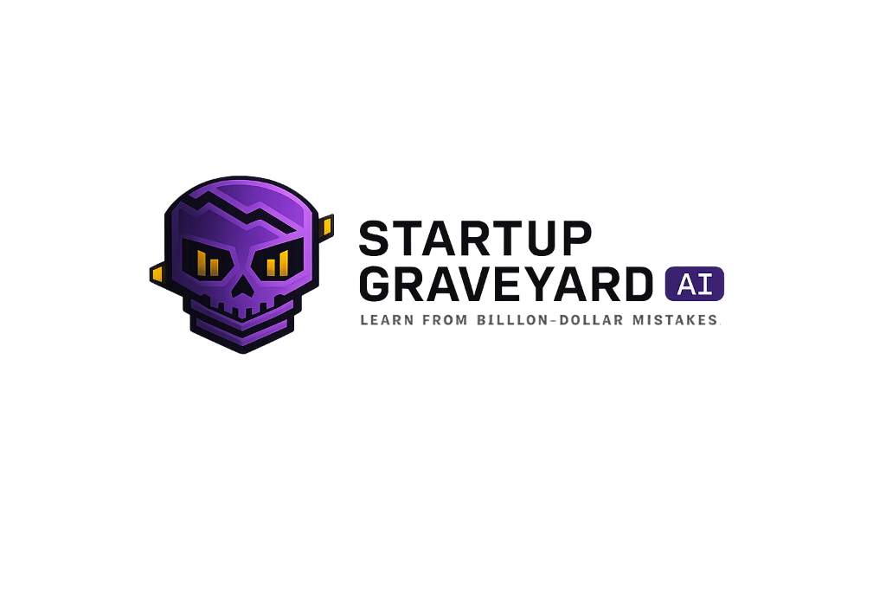

<p align="center">
  
</p>

# Startup Graveyard AI

> **"He who does not learn from history is condemned to repeat it. He who learns from failure is destined to survive."**

Startup Graveyard AI is a professional forensic intelligence platform designed to deconstruct startup failures. It transforms raw data from billion-dollar collapses into actionable intelligence reports. Built with a "Forensic Dossier" aesthetic, the platform leverages advanced RAG (Retrieval-Augmented Generation) and predictive AI to help founders identify fatal risks before they manifest.

---

### ⚠️ Project Status: Improvement Stage
This project is currently under active development. Core modules for forensic analysis and intelligence archiving are operational, but we are continuously refining the predictive models and data high-fidelity.

---

## 🏛️ Intelligence Modules

- **Forensic Autopsy Archive**: A high-density library of failed ventures. Each entry features a "Failure DNA" map, capital decay metrics, and chronological evidence timelines.
- **AI Pre-Mortem Engine**: An interactive interrogation module. Submit your venture details to receive a 4-stage forensic risk report, comparing your strategy against 1,000+ historical fail-points.
- **The Graveyard Keeper (AI Assistant)**: A streaming, contextual intelligence officer capable of answering complex research queries about market hazards and execution errors.
- **Insights Dashboard**: Real-time visualization of startup mortality rates, industry-specific risks, and capital burn taxonomies.

## 🛠️ Technical Architecture

### Core Stack
- **Framework**: [Next.js 15](https://nextjs.org/) (App Router, ISR, TypeScript Strict)
- **Styling**: [Tailwind CSS v4](https://tailwindcss.com/) + [Framer Motion](https://www.framer.com/motion/)
- **Database & Vector Store**: [Supabase](https://supabase.com/) (PostgreSQL + pgvector)
- **AI Integration**: [Vercel AI SDK v6](https://sdk.vercel.ai/docs)

### AI Provider Agnostic
The platform is built on top of the **Vercel AI SDK**, making it completely provider-agnostic. While it is configured for **NVIDIA NIM (DeepSeek-V3)** by default for high-performance forensic analysis, you can easily switch to:
- **OpenAI** (GPT-4o)
- **Anthropic** (Claude 3.5 Sonnet)
- **Google** (Gemini 1.5 Pro)
- **Groq/Local Models** (Llama 3)

## 📦 Installation & Setup

### Prerequisites
- Node.js 20+
- Supabase Account
- AI Provider API Key (NVIDIA, OpenAI, etc.)

### 1. Environment Configuration
Create a `.env.local` file in the root directory:
```env
# AI Configuration (Example for NVIDIA NIM)
NVIDIA_API_KEY=your_api_key
AI_DEFAULT_MODEL=nvidia/deepseek-v3

# Database Configuration
NEXT_PUBLIC_SUPABASE_URL=your_project_url
NEXT_PUBLIC_SUPABASE_ANON_KEY=your_anon_key
SUPABASE_SERVICE_ROLE_KEY=your_service_role_key
```

### 2. Database Initialization
Execute the migrations found in `supabase/migrations/` and seed the database with the provided `supabase/seed.sql` to populate the initial graveyard archives.

### 3. Launch Development Server
```bash
npm install
npm run dev
```

## 📐 Design Philosophy: "Forensic Intelligence"
The UI is inspired by classified intelligence dossiers and investigative boards:
- **Monospace Precision**: Technical data is rendered in `JetBrains Mono`.
- **Editorial Narrative**: Strategic insights use `Fraunces` for weighted authority.
- **Signal Logic**: Interactive elements use a disciplined color system (Amber for Caution, Violet for Intelligence, Red for Failure).

---

## 🤝 Contributing
We are looking for forensic data contributors and AI engineers. Please see the `docs/` folder for the Architecture and PRD details.

*Built with 💀 by [patil-shubham-dev](https://github.com/patil-shubham-dev)*
